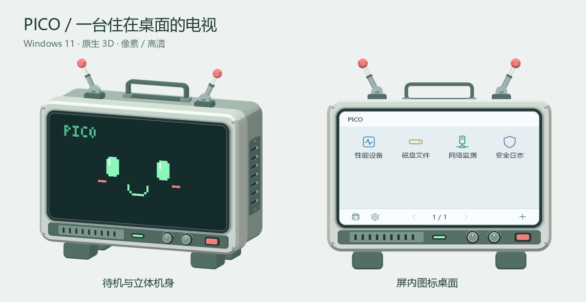
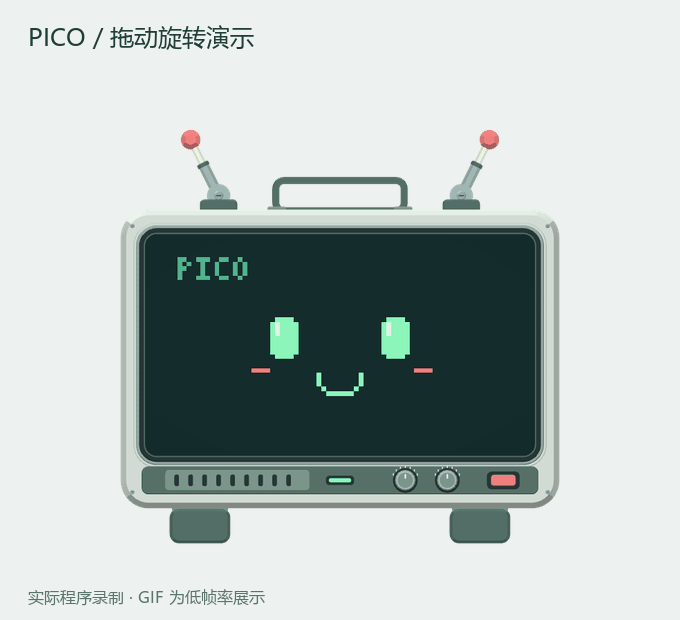
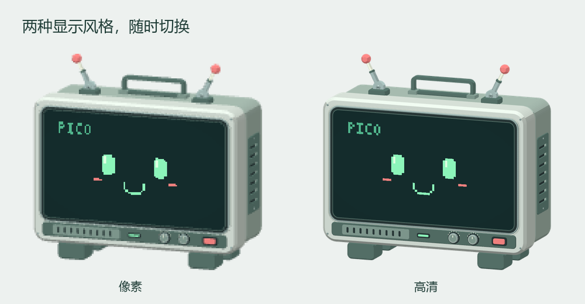
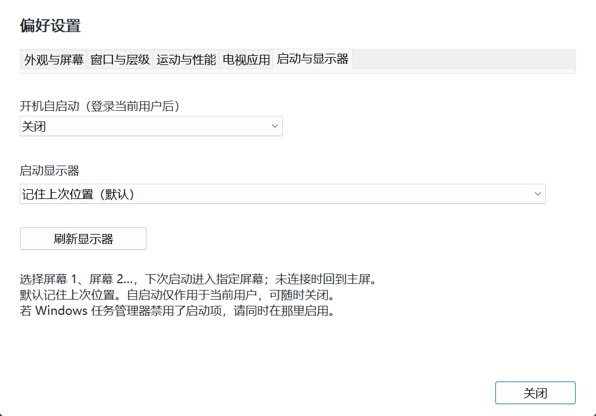

# PICO · Windows 11 电视桌宠

一个可拖拽、旋转和悬浮的 3D 电视桌宠，也是一组按需开启的本机工具。原生 C++20 / Win32 / Direct3D 11 实现，运行时不需要 Python、Node.js、Electron 或浏览器。



## 下载与安装

在 [GitHub Releases](https://github.com/none-pace/pico-pet/releases) 下载构建好的版本；标记为 Pre-release 的版本包含实验性电视应用功能，使用前可查看对应发布说明。

- **安装版**：运行 `PICO-Setup.exe`，安装后重新打开 CMD，输入 `pet` 唤起。
- **便携版**：完整解压 `PICO-Win11-x64.zip`，运行 `PicoPet.exe`；保留同目录的 `PicoPet.Input.dll`。
- **校验**：发布附件 `SHA256SUMS.txt` 提供安装包和 ZIP 的 SHA-256。

## 功能

- **电视桌宠**：LCD 屏幕、像素 / 高清显示、四种机身材质、惯性拖甩、可折叠天线、自定义图片表情。
- **屏内桌面**：系统模块图标、自定义程序 / 文件 / 文件夹快捷方式、完整右键菜单和自动保存的偏好设置。
- **电视应用**：兼容程序窗口嵌入 LCD，独立画布分辨率、屏内鼠标和键盘操作；红色按钮关闭应用后返回图标桌面。
- **启动与显示器**：可选登录后自启动、记住上次位置或固定在屏幕 1 / 屏幕 2 等指定显示器启动。
- **命令终端**：电视屏幕内操作 CMD；可启动本机已安装配置的终端工具。开启终端保留当前模型尺寸，滚轮控制缩放。
- **性能与设备**：CPU、内存、进程资源、硬件分类、驱动版本；可合并同软件、排序、筛选和定格阅读。
- **磁盘与快照**：目录浏览、文件元数据快照、断点续扫和差异比较。
- **网络监测**：软件 / 连接 / 网卡视图、TCP 测速、连接历史、事件捕获、流量曲线和 CSV 导出。
- **安全与日志**：Windows 事件日志、只读注册表浏览、保护状态、程序与文件活动追踪。解读保持简短，原始信息在“证据 / 全部字段”。

## 界面与演示

中键拖动或 Alt + 左键拖动调整模型朝向；左键拖动移动机身，机身滚轮缩放。以下 GIF 从实际程序录制，为控制文件大小降低了演示帧率，不代表应用运行帧率。



像素与高清模式可在偏好设置中切换，两种模式共用同一套屏内功能。



## 构建和运行

仅支持 **Windows 11 x64**。开发环境需要 Visual Studio 2022 或更新版本的“使用 C++ 的桌面开发”工作负载、MSVC x64 工具链和 Windows SDK。

在项目根目录执行：

```powershell
powershell -NoProfile -ExecutionPolicy Bypass -File native/build.ps1
Start-Process native/dist/PicoPet.exe
```

`build.ps1` 自动发现本机工具链，以 C++20、`/W4 /WX` 编译。构建所需的模型和嵌入贴图已包含在仓库中；仅修改 C++ 时不需要重新生成模型。

```powershell
# 自检（桌宠和系统模块）
powershell -NoProfile -ExecutionPolicy Bypass -File native/tools/run_checks.ps1

# 生成便携 ZIP 和安装程序
powershell -NoProfile -ExecutionPolicy Bypass -File native/package.ps1
```

产物为 `native/dist/PicoPet.exe`、`PICO-Win11-x64.zip` 和 `PICO-Setup.exe`。安装包使用 Windows 自带 IExpress；安装到当前用户目录，并注册 `pet` 命令。安装后重新打开终端，输入 `pet` 唤起桌宠。

## 使用

拖动机身移动，滚轮缩放，右键打开完整菜单。鼠标进入屏幕显示模块图标；底栏齿轮进入设置，加号添加快捷方式，终端图标或实体助手按钮进入命令行。详细操作见 [原生应用说明](native/README.md)。

### 开机自启动与多显示器

右键机身 → **偏好设置 → 启动与显示器**：

- **开机自启动**：默认关闭。开启后在当前用户登录 Windows 时启动，无需管理员权限；关闭会移除启动项。
- **启动显示器**：默认记住上次位置，也可选择列表中的屏幕 1、屏幕 2 等。选择后自动保存，下次启动生效。
- **显示器未连接**：临时回到主屏，保留原选择；重新连接后可继续使用。插拔后可点“刷新显示器”。



自启动使用 `HKCU\Software\Microsoft\Windows\CurrentVersion\Run` 的 `PicoPet.Win11` 项。如果在 Windows 任务管理器中禁用了该项，需要在那里重新启用。便携版移动目录后请重新关闭、开启自启动以更新路径；安装版卸载会移除指向该安装目录的启动项。不会创建后台服务或驱动。

网络模块默认显示软件概览。查看短连接和 UDP 时，在视图下拉框选择 **实时捕获 · TCP / UDP**。事件捕获需要管理员或相应事件跟踪权限；没有权限时会显示原因，普通连接表仍可使用。Windows 通常约一秒批量交付事件。

## 电视应用（实验性兼容模式）

点击屏内快捷方式默认在电视中启动并自动接入；偏好设置 → 电视应用 → **快捷方式默认打开位置** 可选择 Windows 桌面。右键快捷方式可临时指定打开位置。Edge / Chrome / Brave 的程序及 `.lnk` 会请求新窗口，复用进程时也识别新窗口，已有窗口不受影响。未能识别的启动器可在机身右键 → 电视应用中手动接入。

**屏幕中不显示桌宠工具栏**，程序画面使用整个 LCD。接入、打开、释放和恢复全部窗口等管理操作集中在机身右键菜单；屏内 Shift+右键也可打开菜单。最多接入 8 个窗口，可选单应用和多窗口布局。

软件运行时，机身下方红色实体按钮亮起，点击后显示退出状态，等待电视内应用关闭后返回图标桌面；重复点击不会重复退出。无响应的独占应用进程会在超时后结束；共享浏览器仅关闭电视内窗口，保留桌面窗口。需要保存确认的应用不会强制结束，会提示先处理确认。右键菜单仍可选择仅释放、恢复窗口。普通模式下红色按钮打开命令助手。

屏内悬停通过 `PicoPet.Input.dll` 的目标线程消息钩子保持：仅在鼠标位于对应电视区域期间过滤已接入窗口误报的 `WM_MOUSELEAVE`，真正离开、暂停或释放时清除。它不轮询抢焦点、不记录键盘输入。DLL 随安装包和便携包提供，应与 EXE 放在同一目录；当前仅支持可加载该钩子的同权限 x64 软件，32 位或拒绝钩子的程序仍可能出现悬停兼容问题。

点击屏内控件后，Windows 原生键盘焦点交给应用。滚轮、水平滚轮和 Ctrl+滚轮操作屏内程序；在机身滚轮缩放电视。桌宠不再将 Ctrl+C/V 等改写为通用编辑消息，原生焦点下由应用处理自己的快捷键和输入法。复杂弹窗、拖放及部分应用的焦点行为仍可能不兼容。

**应用画面上限**默认 60 FPS，可设 5–60，独立于模型动画帧率。采集线程使用高精度计时，画面变化后直接通知电视刷新，最多积压一个通知，消除辅助进程和电视两层定时轮询；静止超过半秒后降低至最多 10 次/秒检测，有输入或画面变化即恢复。隐藏或暂停停止采样。上限不是保证值，窗口自身绘制及 PrintWindow 耗时仍会限制实际帧率。

**电视应用画布分辨率**默认自动补偿系统 DPI，按完整 LCD 的 800:500 比例计算，宽度限制在 1280–1920；150% 缩放时为 1536×960。固定档位为 800×500、1280×800、1600×1000，即时保存。画布独立于 Windows 桌面分辨率，电视缩放不改变应用布局；最终采样纹理为 800×500。网页长内容仍保留正常滚动，全屏交给应用自身控制。

这是同会话的窗口容器，不是完整虚拟系统或安全隔离。普通最大化限制在容器内，其他 GPU 界面、独占全屏和独立弹窗不保证兼容。通过菜单释放窗口、退出桌宠或桌宠主进程异常退出时，由辅助进程恢复仍存活窗口的原父级、样式和位置；红色按钮执行的是关闭电视内应用。

## 数据与能力边界

- 设置、快捷方式、图片和索引保存在 `%LOCALAPPDATA%\PicoPet`，卸载保留这些数据。
- 内置监测与规则解读在本机运行，不上传采集记录。启用 PTR 反查会使用系统 DNS；用户执行的命令和打开的外部程序按各自配置联网。
- 网络事件记录地址、端口和字节数，不解密 HTTPS，不将反查域名当作请求 URL。短连接仍可能遗漏；上传提示不是恶意或泄露结论。
- 软件概览汇总已测 TCP；UDP / 短连接事件独立展示，避免重复计算。事件保留最近 10 分钟、最多 8192 个通信对象；丢失或容量丢弃会提示。
- 网络面板关闭、最小化、切走或暂停后停止采集；“定格阅读”仅固定画面，后台采集继续。桌宠静止时按需渲染，实际占用取决于尺寸、动画和采集负载。
- 磁盘快照是元数据比较，不包含文件内容，也不是原子备份。系统状态来自 Windows API，不保证系统本身未受篡改。

## 源码结构

| 位置 | 职责 |
| --- | --- |
| `native/src/main.cpp` | 应用生命周期、窗口输入、屏内桌面与渲染协调 |
| `native/src/realtime_model.h`、`pixel_renderer.h` | D3D11 模型、命中检测、像素合成与兼容路径 |
| `native/src/interaction.h`、`frame_scheduler.h` | 交互运动与帧调度 |
| `native/src/system_core.h` | 系统模块共享类型及采集接口 |
| `native/src/system_*.cpp` | 性能、设备、网络、事件、日志、索引和系统窗口 |
| `native/src/system_cards.h`、`system_presentation.h`、`system_observations.h` | 卡片交互、字段展示、历史与聚合 |
| `native/src/embedded_console.*` | 屏内终端及进程生命周期 |
| `native/src/app_workspace.*` | 电视应用容器、画面采集、输入投影和异步关闭 |
| `native/src/app_input_hook.cpp` | 目标应用线程悬停兼容钩子，构建为 `PicoPet.Input.dll` |
| `native/src/startup.h` | 当前用户自启动注册、显示器枚举与启动位置选择 |
| `native/src/*_tests.h` | 内置回归检查，与功能模块对应 |
| `native/tools/` | 检查、交互回归、性能测量和资源生成；公共界面测试代码集中在 `test_support.ps1` |
| `native/assets/` | 编译时嵌入的模型、图标和贴图 |
| `native/installer/` | 当前用户安装器与 `pet` 命令 |
| `docs/media/` | README 展示图与实际操作 GIF；不包含个人运行记录 |
| `tv3d/` | 模型生成、Three.js 预览与 glTF 验证，见 [模型说明](tv3d/README.md) |

## 开发约定

1. 优先在现有职责模块中修改；提取公共实现时要替换调用方，不保留同用途旧实现。不要按版本复制源码、临时构建器或截图脚本。
2. 生产源码清单和编译参数只维护在 `native/build.ps1`，版本只在 `native/resources.rc` 更新。运行数据、截图、测试报告和构建产物不提交。
3. C++20，四空格缩进；MSVC 警告视为错误。PowerShell 脚本保留 UTF-8 BOM，以兼容 Windows PowerShell 5.1 的中文文本。编辑器规则见 `.editorconfig`。
4. 修改后运行构建与 `run_checks.ps1`；窗口、渲染、输入的修改再运行对应 `exercise_*.ps1`。界面测试会移动鼠标、打开窗口和改变设置，应在测试桌面运行，提前备份用户配置。
5. 公共界面测试通过点导入 `test_support.ps1` 使用 Win32 辅助代码；不要截取其他测试脚本再 `Invoke-Expression`。
6. 发布前从干净检出构建，检查必需资源完整；不要提交本机网络日志、磁盘索引、屏幕截图、账户配置或凭据。

版本变化见 [发布说明](https://github.com/none-pace/pico-pet/releases) 和 Git 历史；交互回归入口见 [原生应用说明](native/README.md#性能与开发)。
